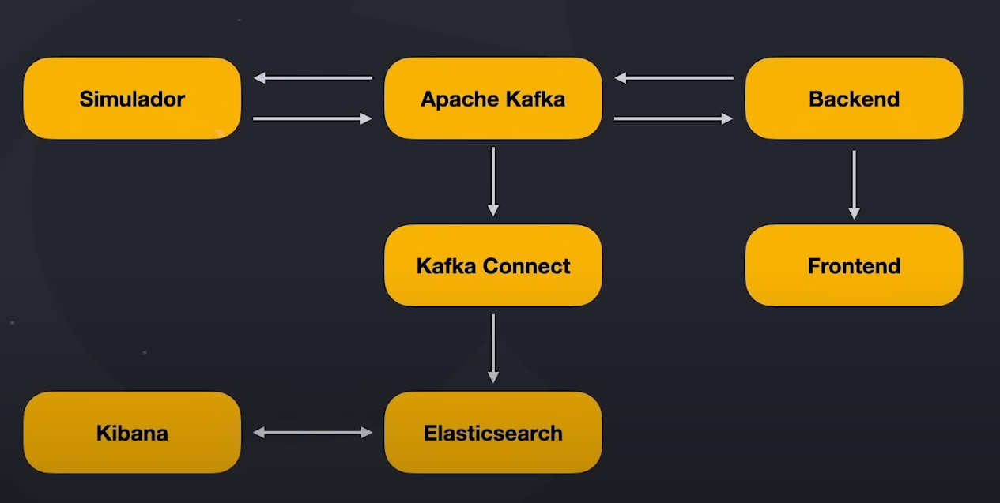

## Code Delivery - Estudo de caso pratico

### O que estou desenvolvendo desenvolvendo?

- Sistema de entregas que permite visualizar em tempo real o veiculo do entregador;
- Há a possibilidade de múltiplos entregadores simultâneos;
- Serviço simulador que enviará a posição em tempo real de cada entregador;
- Os dados de cada entrega, bem como as posições, serão armazenadas no Elasticsearch para futuras analises.

### Alguns desafios

- Para evitar perda de informação caso o serviço backend fique indisponível por alguns momentos, NÃO, trabalharemos com REST.

**Solução**: Trabalharemos com o Apache Kafka para o envio e recebimento de dados entre os sistemas.

- Nao é responsabilidade do serviço backend persistir os dados no Elasticsearch. Logo, como armazenar as informações no Elasticsearch?

**Solução**: Utilizaremos o Kafka Connect que também consumira os dados do simulador e fará a inserção no Elasticsearch

- Precisaremos exibir em tempo real a localização de cada entregador 

**Solução**: Trabalharemos com websockets. O backend recebera os dados do simulador, e enviar as posições para o frontend via websocket.

### Dinâmica do sistema

### Tecnologias a serem utilizadas

- Simulador: Golang
- Backend: Nest.js & Mongo
- Frontend: React
- Kafka e Kafka connect
- Elasticsearch & Kibana
- Docker e Kubernetes
- Istio, Kiali, Prometheus & Grafana
